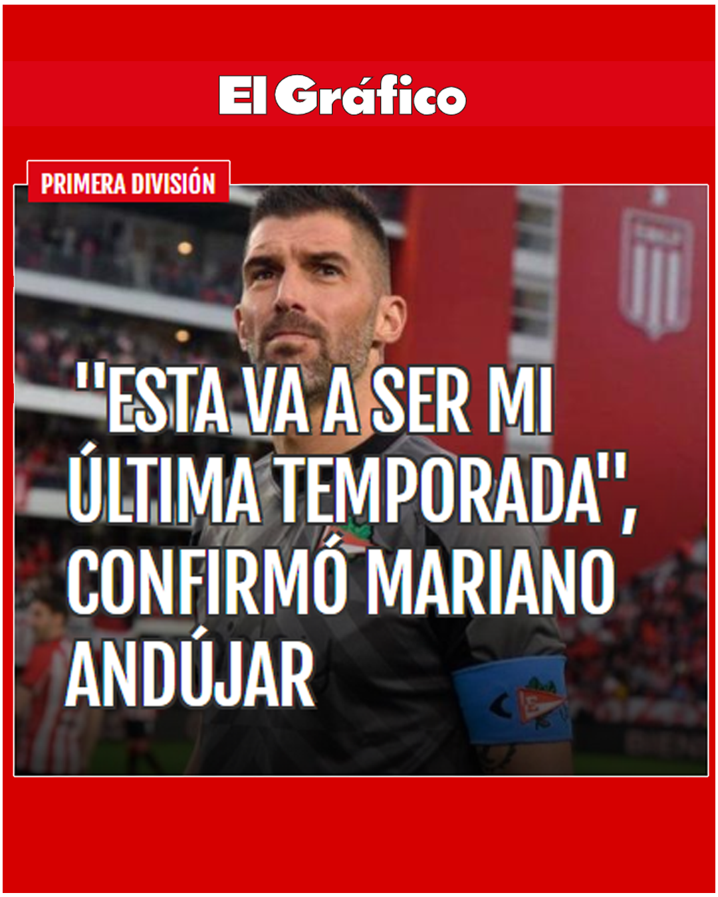

A Catania qualcuno lo celebra più per le sue <i>performace</i> da pugile in un derby col Palermo che per quelle da portiere, ma Mariano Andújar ha giocato nel Catania in Serie A dal 2009 al 2014 (con l’intervallo di un prestito all’Estudiantes) disputando 146 partite.
<!--more-->

Tornato all’Estudiantes, è da poco diventato il portiere con il maggior numero di rigori parati nei tempi regolamentari con la maglia biancorossa. 
Di recente ha anche annunciato che al terminde della stagione 2023/24 si ritirerà, come ha scritto il popolare magazine sudamericano "ElGrafico".

